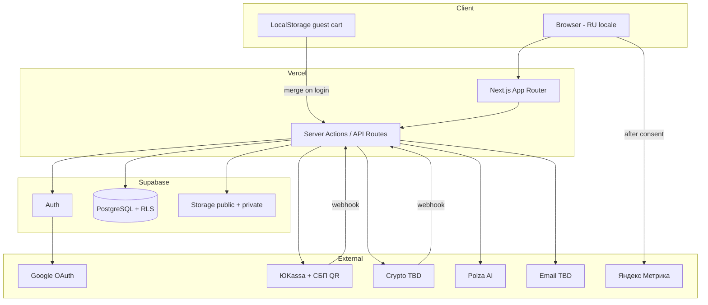
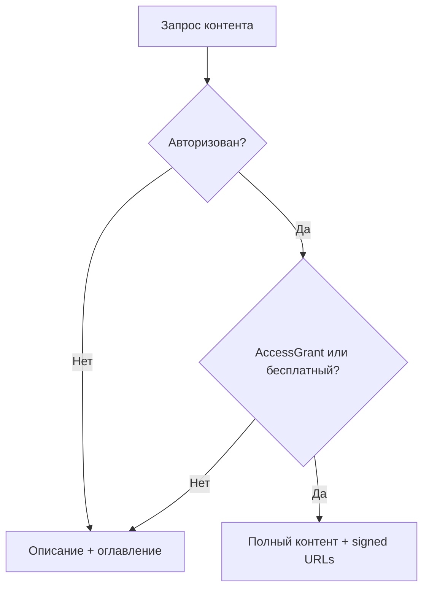

# Architecture

Архитектура платформы «Дизайн Тусовка». Синхронизировано с этапом 1.1.

## Обзор



## Структура репозитория (фактическая, этап 3.3.2)

```
src/
  app/
    globals.css            # Tailwind v4 + shadcn tokens
    layout.tsx             # ru, Inter, header/main/footer
    page.tsx               # Демо дизайн-системы (временная)
  components/
    layout/
    ui/                    # shadcn
  lib/
    utils.ts
  types/
    database.types.ts      # supabase gen types (public)
supabase/
  config.toml
  migrations/
  tests/database/        # pgTAP RLS tests (этап 3.3.3)
  seed.sql
components.json
docs/
.cursor/
```

### Планируемая структура (этапы 4+)

```
src/app/
  (auth)/
  (app)/library|cart|checkout|profile|materials|assignments|sections
  (admin)/
  api/webhooks/
src/lib/supabase|payments|polza|cart|access|storage/
```

## Схема БД

### Каталог (этап 3.2)

Миграция `create_catalog_content_schema`: **`products`** + расширения, RLS enabled.

### Профили и доступ (этап 3.3.1)

`profiles`, `admin_users`, `entitlements`, `has_product_access`, `update_my_profile`, trigger на `auth.users`.

### Каталог RLS (этап 3.3.2)

Миграция `create_catalog_read_policies`:

- SELECT policies для published metadata (`products`, `sections`, `materials`, `tasks`, `tags`, …)
- `material_chapters` — только с `has_product_access` (authenticated)
- `task_content` / `task_ai_criteria` — free task или entitlement
- RPC `get_material_toc` — оглавление без `content`

### RLS tests (этап 3.3.3)

`supabase test db --local` → `npm run db:test`. Файл `supabase/tests/database/01_catalog_rls.test.sql`.

### API grants (этап 3.3.4)

Миграция `20260618195500_grant_api_access_for_rls.sql`:

- `GRANT USAGE ON SCHEMA public` + `SELECT` на каталог для `anon`/`authenticated`
- `SELECT` на `profiles`, `entitlements`, `material_chapters` — только `authenticated`
- `admin_users` без client grants; client writes на каталог/profiles/entitlements — нет
- RPC: `has_product_access` — только `authenticated`; task policies разделены на free/entitled (anon не читает `entitlements` через RLS)

**Команды:** `db:reset` | `db:lint` | `db:types` | `db:test` | `supabase:*`.

Корзина, заказы, платежи, Storage, auth UI, `src/lib/supabase/` — **не созданы**.

См. `DATA_MODEL.md`, ADR-019–023.

## Локальная разработка Supabase (этап 3.1)

| Компонент | Локальный адрес |
|-----------|-----------------|
| API (Project URL) | `http://127.0.0.1:54321` |
| PostgreSQL | `127.0.0.1:54322` |
| Studio | `http://127.0.0.1:54323` |
| Mailpit (Auth email) | `http://127.0.0.1:54324` |

**Требования:** Docker Desktop (WSL2 backend на Windows).

**Команды:** `npm run supabase:start` | `supabase:stop` | `supabase:status` | `db:reset` | `db:lint` | `db:types`.

Ключи и connection string для локальной среды выводятся `supabase status` и копируются в `.env.local` (не коммитятся). Имена переменных — см. `INTEGRATIONS.md` и `.env.example`.

Клиенты `src/lib/supabase/` — этап 4+.

## Ключевые потоки

### Гостевая корзина → merge

1. Гость: `CartItem[]` в localStorage.
2. Login: Server Action merge → dedupe → sync to DB `cart_items`.
3. Правила CART-* на сервере при каждом изменении.

### Доступ к контенту



### Раздел: цена с вычетом

При добавлении раздела в checkout сервер:

1. Список материалов раздела.
2. Сумма `OrderItem.price_rub` уже оплаченных пользователем материалов из этого раздела.
3. `section.price_rub - paid_sum` (min 0).

### Оплата ручной проверки

Отдельный от корзины маршрут checkout на финальном шаге `UF-11`; тот же webhook-паттерн ADR-003.

### Файлы

| Тип | Bucket | Доступ |
|-----|--------|--------|
| Обложки | public-media | CDN public |
| Вложения материалов | по политике | public или signed |
| Решения, feedback | private-files | signed после ACCESS-11 |

## Дизайн (токены)

- `--primary: #094BF5`
- Font: Inter (next/font)
- `--radius-card: 16px`
- `--radius-button: 12px`
- Badge: `rounded-full`

## Безопасность

См. `.cursor/rules/security.mdc` и `BUSINESS_RULES.md` SECU-*.

## Деплой

- Vercel + Supabase cloud
- GitHub — инициализация перед этапом 2
- Env в Vercel Dashboard

## Связанные документы

- `DATA_MODEL.md`, `DECISIONS.md`, `INTEGRATIONS.md`, `PRODUCT.md`
