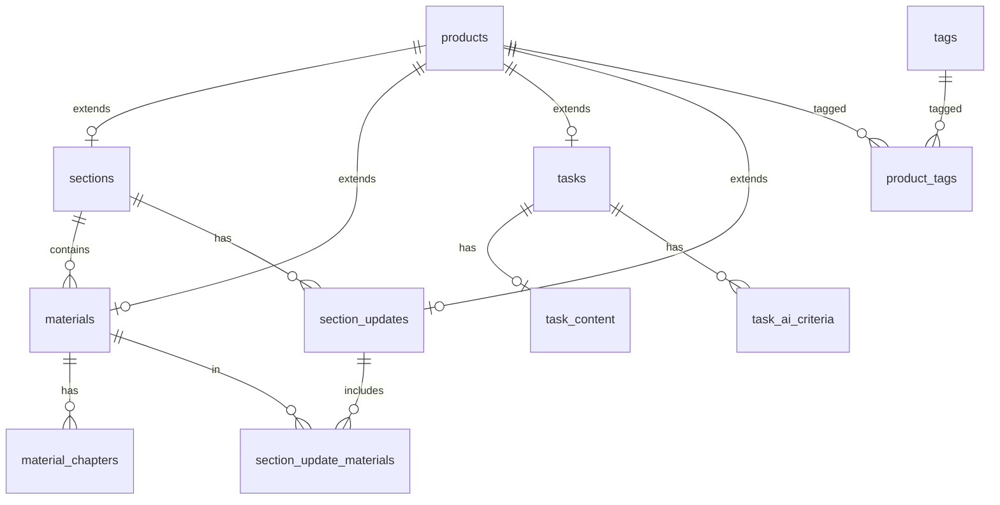

# Data Model

Модель данных платформы «Дизайн Тусовка». Миграции — `supabase/migrations/`.

## Принципы

- PostgreSQL через **Supabase**; миграции в `supabase/migrations/`.
- `auth.users` — идентичность; `profiles` — расширение (**ещё не реализовано**).
- **Supabase Storage**: публичные и приватные bucket (**ещё не созданы**).
- Один клиент БД (Supabase JS); Prisma — только по ADR при необходимости.
- RLS включён на пользовательских таблицах; **политики — этап 3.3**.
- Цены в **копейках** (`price_kopecks integer`); `0` = бесплатно; отдельного `is_free` нет.
- Обложки — `products.cover_path` (путь в Storage, bucket на будущих этапах).

## Паттерн `products` (этап 3.2)

Все товары каталога — одна строка в **`products`** с полем `kind` (`product_kind`). Специализированные таблицы (`sections`, `materials`, `tasks`, `section_updates`) ссылаются на `products.id` через `product_id` (1:1, PK или FK).

**Зачем:** единый slug, статус публикации, цена, обложка и теги для любого товара; заказы и entitlements на этапах 3.4+ ссылаются на один `product_id`.

| `product_kind` | Таблица расширения |
|----------------|-------------------|
| `section` | `sections` |
| `material` | `materials` |
| `task` | `tasks` |
| `section_update` | `section_updates` |

## Enums (реализовано)

| Enum | Значения |
|------|----------|
| `product_kind` | material, task, section, section_update |
| `product_status` | draft, published, hidden |
| `material_format` | mini_guide, full_guide, notes, checklist, template, cheat_sheet, lesson, practice |
| `designer_level` | junior, middle, senior, all |

## Таблицы каталога (этап 3.2)

### `products`

| Колонка | Тип | Примечание |
|---------|-----|------------|
| id | uuid PK | `gen_random_uuid()` |
| kind | product_kind | |
| status | product_status | default draft |
| slug | text unique | lowercase, `[a-z0-9-]+` |
| title | text | not empty |
| description | text | default '' |
| cover_path | text | nullable |
| price_kopecks | integer | >= 0, default 0 |
| published_at | timestamptz | nullable |
| created_at, updated_at | timestamptz | trigger `set_updated_at` |

Индексы: kind, status, published_at, price_kopecks.

### `sections`

PK `product_id` → `products`. Поля: `position`, `what_you_get` (jsonb), `for_whom` (jsonb).

**Trigger:** `products.kind` должен быть `section`.

### `materials`

PK `product_id` → `products`. FK `section_product_id` → `sections`.

Поля: `format`, `level` (default all).

**Trigger:** `products.kind` = `material`. Индекс `section_product_id`.

### `material_chapters`

Главы материала: `title`, `content` (jsonb blocks), `position`.

Unique `(material_product_id, position)`. `position >= 0`.

### `tasks`

Задание вне разделов. Поля: `level`, `ai_review_available`, `manual_review_available`, `manual_review_price_kopecks` (nullable, >= 0).

**Trigger:** `products.kind` = `task`.

### `task_content`

1:1 с `tasks`: `brief`, `submission_requirements` (jsonb).

### `task_ai_criteria`

Критерии AI-проверки: `title`, `description`, `position`. Unique `(task_product_id, position)`.

### `tags` / `product_tags`

Теги: `slug` (valid), `name`. M2M `product_tags(product_id, tag_id)`.

### `section_updates`

Обновление раздела: FK `section_product_id`, `release_number` > 0, unique `(section_product_id, release_number)`.

**Trigger:** `products.kind` = `section_update`.

### `section_update_materials`

M2M обновление ↔ материалы. **Trigger:** материал должен принадлежать тому же разделу, что и обновление.

## Функции и триггеры (этап 3.2)

| Имя | Назначение |
|-----|------------|
| `set_updated_at()` | BEFORE UPDATE → `updated_at = now()` |
| `is_valid_slug(text)` | Проверка slug в CHECK |
| `ensure_product_kind()` | BEFORE INSERT/UPDATE на sections, materials, tasks, section_updates |
| `ensure_section_update_material_same_section()` | BEFORE INSERT/UPDATE на section_update_materials |

## RLS (этап 3.2)

На всех 11 таблицах каталога: **`ENABLE ROW LEVEL SECURITY`**, разрешающих политик **нет** — доступ заблокирован для anon/authenticated до этапа 3.3.

## ER-диаграмма (каталог, этап 3.2)

## Ещё не реализовано (следующие этапы)

| Область | Таблицы / сущности |
|---------|-------------------|
| Профили | `profiles` |
| Корзина | `cart_items` |
| Заказы / оплата | `orders`, `order_items`, `payments`, `webhook_events` |
| Доступ | `access_grants`, `access_grant_errors` |
| Отправки / проверки | `submissions`, `ai_reviews`, `manual_reviews` |
| Отзывы на товары | `product_reviews` |
| Уведомления | `notifications` |
| Админ-медиа | `media_library` |
| Storage | buckets `public-media`, `private-files` |

Продуктовые имена из этапа 1.1 (`Assignment` → **`tasks`**, `Material.type` → **`material_format`**, цены в рублях в документации → **копейки в БД**).

## Storage buckets (план)

| Bucket | Доступ | Содержимое |
|--------|--------|------------|
| public-media | public | Обложки, изображения |
| private-files | private | PDF, решения, feedback |

## TypeScript types

`npm run db:types` → `src/types/database.types.ts` (схема `public`).

## Не в MVP

- История изменений материалов, заказов, цен
- Прогресс обучения
