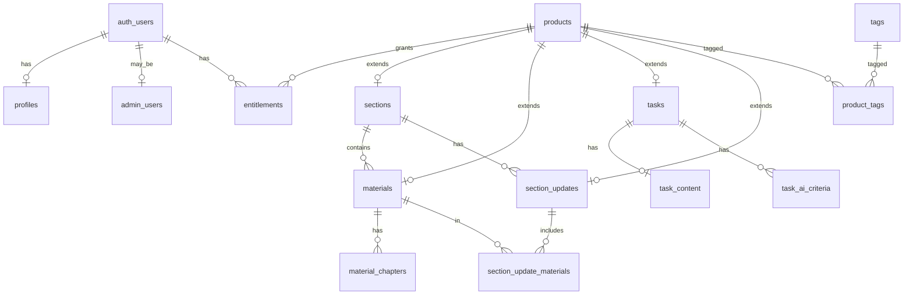

# Data Model

Модель данных платформы «Дизайн Тусовка». Миграции — `supabase/migrations/`.

## Принципы

- PostgreSQL через **Supabase**; миграции в `supabase/migrations/`.
- `auth.users` — идентичность; `profiles` — расширение (**этап 3.3.1**).
- **Supabase Storage**: публичные и приватные bucket (**ещё не созданы**).
- Один клиент БД (Supabase JS); Prisma — только по ADR при необходимости.
- RLS включён; политики каталога — **этап 3.3.2**; профили и entitlements — **этап 3.3.1**.
- Цены в **копейках** (`price_kopecks integer`); `0` = бесплатно; отдельного `is_free` нет.
- Обложки — `products.cover_path` (путь в Storage, bucket на будущих этапах).

## Паттерн `products` (этап 3.2)

Все товары каталога — одна строка в **`products`** с полем `kind` (`product_kind`). Специализированные таблицы (`sections`, `materials`, `tasks`, `section_updates`) ссылаются на `products.id` через `product_id` (1:1, PK или FK).

**Зачем:** единый slug, статус публикации, цена, обложка и теги для любого товара; заказы и **`entitlements`** ссылаются на один `product_id`.

| `product_kind` | Таблица расширения |
|----------------|-------------------|
| `section` | `sections` |
| `material` | `materials` |
| `task` | `tasks` |
| `section_update` | `section_updates` |

## Enums (реализовано)

| Enum | Значения |
|------|----------|
| `product_kind` | material, task, section, section_update |
| `product_status` | draft, published, hidden |
| `material_format` | mini_guide, full_guide, notes, checklist, template, cheat_sheet, lesson, practice |
| `designer_level` | junior, middle, senior, all |
| `entitlement_source_type` | direct_order, zero_order, section_order, section_update, manual, free_task_submission, all_materials_owned |

## Таблицы каталога (этап 3.2)

### `products`

| Колонка | Тип | Примечание |
|---------|-----|------------|
| id | uuid PK | `gen_random_uuid()` |
| kind | product_kind | |
| status | product_status | default draft |
| slug | text unique | lowercase, `[a-z0-9-]+` |
| title | text | not empty |
| description | text | default '' |
| cover_path | text | nullable |
| price_kopecks | integer | >= 0, default 0 |
| published_at | timestamptz | nullable |
| created_at, updated_at | timestamptz | trigger `set_updated_at` |

Индексы: kind, status, published_at, price_kopecks.

### `sections`

PK `product_id` → `products`. Поля: `position`, `what_you_get` (jsonb), `for_whom` (jsonb).

**Trigger:** `products.kind` должен быть `section`.

### `materials`

PK `product_id` → `products`. FK `section_product_id` → `sections`.

Поля: `format`, `level` (default all).

**Trigger:** `products.kind` = `material`. Индекс `section_product_id`.

### `material_chapters`

Главы материала: `title`, `content` (jsonb blocks), `position`.

Unique `(material_product_id, position)`. `position >= 0`.

### `tasks`

Задание вне разделов. Поля: `level`, `ai_review_available`, `manual_review_available`, `manual_review_price_kopecks` (nullable, >= 0).

**Trigger:** `products.kind` = `task`.

### `task_content`

1:1 с `tasks`: `brief`, `submission_requirements` (jsonb).

### `task_ai_criteria`

Критерии AI-проверки: `title`, `description`, `position`. Unique `(task_product_id, position)`.

### `tags` / `product_tags`

Теги: `slug` (valid), `name`. M2M `product_tags(product_id, tag_id)`.

### `section_updates`

Обновление раздела: FK `section_product_id`, `release_number` > 0, unique `(section_product_id, release_number)`.

**Trigger:** `products.kind` = `section_update`.

### `section_update_materials`

M2M обновление ↔ материалы. **Trigger:** материал должен принадлежать тому же разделу, что и обновление.

## Функции и триггеры (этап 3.2)

| Имя | Назначение |
|-----|------------|
| `set_updated_at()` | BEFORE UPDATE → `updated_at = now()` |
| `is_valid_slug(text)` | Проверка slug в CHECK |
| `ensure_product_kind()` | BEFORE INSERT/UPDATE на sections, materials, tasks, section_updates |
| `ensure_section_update_material_same_section()` | BEFORE INSERT/UPDATE на section_update_materials |

## RLS каталога (этап 3.3.2)

### Публичное чтение metadata (`anon`, `authenticated`)

| Таблица | Условие SELECT |
|---------|----------------|
| `products` | `status = published` |
| `sections` | связанный product published |
| `materials` | связанный product published |
| `tasks` | связанный product published |
| `tags` | связан хотя бы с одним published product |
| `product_tags` | product published |
| `section_updates` | update product и section product published |
| `section_update_materials` | section update product published |

Draft/hidden **не** читаются клиентом. **INSERT/UPDATE/DELETE** для каталога с клиента **не разрешены** (admin/server позже).

### `material_chapters` — почему не публично

Строка содержит поле **`content`**. Public SELECT на таблицу привёл бы к утечке платного контента.

| Доступ | Правило |
|--------|---------|
| `authenticated` + entitlement | `has_product_access(material_product_id)` — полная строка включая `content` |
| Оглавление без content | RPC **`get_material_toc(material_product_id)`** — `id`, `title`, `position`; published material; **без entitlement**; `anon` + `authenticated` |

### `task_content` / `task_ai_criteria`

Две политики на таблицу (этап 3.3.4 — разделение, чтобы `anon` не вызывал `has_product_access`):

| Политика | Роли | Условие |
|----------|------|---------|
| `*_select_free` | `anon`, `authenticated` | task **published**, `price_kopecks = 0` |
| `*_select_entitled` | `authenticated` | task **published**, `price_kopecks > 0`, `has_product_access(task_product_id)` |

Платный контент без entitlement **не** открывается.

### RPC `get_material_toc(uuid)`

`SECURITY DEFINER`, `search_path = public`. Не принимает `user_id`. Не возвращает `content`. Не показывает draft/hidden.

### RLS verification tests (этап 3.3.3)

pgTAP-тесты: `supabase/tests/database/01_catalog_rls.test.sql`, запуск `npm run db:test` (`supabase test db --local`).

Покрыто: published-only products, toc без content, chapters entitlement, free/paid task content, profile/entitlement isolation, client write denial.

Тесты **не** подменяют grants — проверяют схему после `db:reset` (миграции 3.3.4).

### API grants для PostgREST (этап 3.3.4)

RLS фильтрует строки, но без `GRANT` роль не может обращаться к таблице через PostgREST/API. Миграция `20260618195500_grant_api_access_for_rls.sql`.

| Роль | `GRANT SELECT` |
|------|----------------|
| `anon`, `authenticated` | `products`, `sections`, `materials`, `tasks`, `tags`, `product_tags`, `section_updates`, `section_update_materials`, `task_content`, `task_ai_criteria` |
| `authenticated` only | `profiles`, `entitlements`, `material_chapters` |

**Без client grants:** `admin_users`. **Нет** client `INSERT`/`UPDATE`/`DELETE` на каталог, profiles, entitlements, admin_users.

| RPC | `EXECUTE` |
|-----|-----------|
| `get_material_toc(uuid)` | `anon`, `authenticated` (миграция 3.3.2) |
| `has_product_access(uuid)` | `authenticated` only (`REVOKE` от `anon` в 3.3.4) |
| `update_my_profile(...)` | `authenticated` only (миграция 3.3.1) |

## Профили и доступ (этап 3.3.1)

### Создание профиля

После `INSERT` в `auth.users` (email/password или Google OAuth) срабатывает trigger **`on_auth_user_created`** → функция **`handle_new_user()`** (`SECURITY DEFINER`, `search_path = public`):

- вставляет строку в `profiles` с тем же `id`;
- `display_name` из `raw_user_meta_data` (`display_name`, `full_name`, `name`) или `NULL`, если metadata пустая;
- email **не** копируется; admin **не** выдаётся.

### `profiles`

| Колонка | Примечание |
|---------|------------|
| id | PK, FK → `auth.users` |
| display_name, avatar_path, telegram_username | nullable |
| designer_level | default `all` |
| deactivated_at | только сервер/админ (клиент не меняет) |
| created_at, updated_at | trigger `set_updated_at` |

**RLS:** authenticated — `SELECT` только свой профиль (`id = auth.uid()`). Прямой `INSERT`/`UPDATE`/`DELETE` с клиента **запрещены** — правка через RPC **`update_my_profile`**.

### Почему admin отдельно

Флаг админа **не** в `profiles`: таблица **`admin_users(user_id)`** — только service role / server-side. Клиент не может прочитать или добавить себя (RLS без политик).

### `entitlements`

Доступ к `product_id` для `user_id`. Несколько источников на один товар — **отдельные строки** с unique `(user_id, product_id, source_type, source_id)`.

| Колонка | Примечание |
|---------|------------|
| source_type | `entitlement_source_type` |
| source_id | UUID источника (order, manual grant и т.д.) |
| granted_at, revoked_at | активный доступ: `revoked_at IS NULL` |
| metadata | jsonb, default `{}` |

**RLS:** authenticated — `SELECT` только свои записи. `INSERT`/`UPDATE`/`DELETE` с клиента **запрещены** (выдача — server/webhook на будущих этапах).

### `has_product_access(product_id)`

SQL-функция (`SECURITY INVOKER`): `true`, если у **`auth.uid()`** есть активный entitlement на товар; **anon** → `false`. Не принимает `user_id`, не выдаёт доступ.

### `update_my_profile(...)`

RPC (`SECURITY DEFINER`): меняет только `display_name`, `avatar_path`, `telegram_username`, `designer_level` (и `updated_at` через trigger) **своего** профиля. Только **authenticated**.

### Запрещено клиенту (anon/authenticated через PostgREST)

| Объект | Запрет |
|--------|--------|
| `profiles` | insert, update, delete напрямую |
| `admin_users` | любой доступ |
| `entitlements` | insert, update, delete |
| Каталог | insert, update, delete; read только по policies 3.3.2 |

## ER-диаграмма (каталог + доступ)

## Ещё не реализовано (следующие этапы)

| Область | Таблицы / сущности |
|---------|-------------------|
| Каталог RLS | политики публичного чтения (**этап 3.3.2**) |
| Корзина | `cart_items` |
| Заказы / оплата | `orders`, `order_items`, `payments`, `webhook_events` |
| Ошибки доступа | `access_grant_errors` |
| Отправки / проверки | `submissions`, `ai_reviews`, `manual_reviews` |
| Отзывы на товары | `product_reviews` |
| Уведомления | `notifications` |
| Админ-медиа | `media_library` |
| Storage | buckets `public-media`, `private-files` |

Продуктовые имена из этапа 1.1 (`Assignment` → **`tasks`**, `Material.type` → **`material_format`**, цены в рублях в документации → **копейки в БД**).

## Storage buckets (план)

| Bucket | Доступ | Содержимое |
|--------|--------|------------|
| public-media | public | Обложки, изображения |
| private-files | private | PDF, решения, feedback |

## TypeScript types

`npm run db:types` → `src/types/database.types.ts` (схема `public`).

## Не в MVP

- История изменений материалов, заказов, цен
- Прогресс обучения
