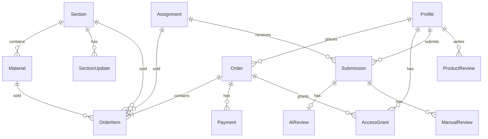

# Data Model

Модель данных платформы «Дизайн Тусовка». Миграции — этап 3.

## Принципы

- PostgreSQL через **Supabase**; миграции в `supabase/migrations/`.
- `auth.users` — идентичность; `profiles` — расширение.
- **Supabase Storage**: публичные и приватные bucket; приватные — signed URL после проверки прав на сервере.
- Один клиент БД (Supabase JS); Prisma — только по ADR при необходимости.
- RLS на пользовательских таблицах.

## Сущности

### Profile

| Поле | Описание |
|------|----------|
| user_id | FK → auth.users |
| name | Имя |
| avatar_url | Аватар (Storage) |
| telegram | Telegram |
| designer_level | junior / middle / senior |
| is_deactivated | Деактивация через поддержку |
| is_admin | В MVP: один владелец |

### Material

| Поле | Описание |
|------|----------|
| section_id | FK → Section (ровно один раздел) |
| title, description, cover_url | Основное |
| type | enum: mini_guide, full_guide, summary, checklist, template, cheat_sheet, lesson, practice |
| level | junior / middle / senior |
| tags | массив или M2M |
| price_rub | Цена в рублях; 0 = бесплатный |
| content | Блочный контент (главы на одной странице) |
| status | draft / published / hidden |
| has_manual_review | Флаг для фильтра «наличие проверки» (задания) — для материалов N/A |

Вложения: отдельная таблица `material_attachments` (Storage path, имя, mime).

### Section (раздел)

| Поле | Описание |
|------|----------|
| title, description, cover_url | Основное |
| price_rub | Базовая цена набора |
| status | draft / published / hidden |
| catalog_order | Порядок в каталоге |

Связь: Section 1—N Material.

### SectionUpdate (обновление раздела)

| Поле | Описание |
|------|----------|
| section_id | FK |
| price_rub | Цена обновления |
| published_at | Дата публикации |
| material_ids | Материалы, входящие в это обновление (M2M или JSON) |

### Assignment (задание)

Отдельный товар; **не** привязан к разделу.

| Поле | Описание |
|------|----------|
| title, description, cover_url | Как материал |
| price_rub | 0 или платно |
| level, tags | |
| content | Страница по той же схеме, что материал |
| ai_criteria | Список критериев (текст, без весов) |
| manual_review_price_rub | **TBD** — цена ручной проверки |
| status | draft / published / hidden |

### Cart / CartItem

| CartItem | |
|----------|--|
| cart_id | Гостевой (localStorage + server sync) или user_id |
| item_type | material / assignment / section / section_update |
| item_id | UUID |
| user_id | null для гостя до merge |

### Order / OrderItem

| Order | |
|-------|--|
| user_id | |
| total_rub | Серверный расчёт |
| status | pending_payment / paid / cancelled / failed / completed_free |
| payment_method | yookassa / sbp / crypto / null (0 ₽) |

| OrderItem | |
|-----------|--|
| order_id | |
| item_type, item_id | |
| price_rub | Snapshot на момент заказа |
| title_snapshot | |

### Payment

| Поле | Описание |
|------|----------|
| order_id | FK (null для оплаты только ручной проверки — отдельный тип заказа TBD на этапе 13) |
| provider | yookassa / sbp / crypto |
| external_id | ID у провайдера |
| amount_rub | |
| crypto_usdt_rate | При крипто — зафиксированный курс |
| status | по API провайдера |
| idempotency_key | |

### AccessGrant

| Поле | Описание |
|------|----------|
| user_id | |
| grant_type | material / assignment / section / section_update |
| grant_id | ID сущности |
| order_id | Источник доступа |
| revoked_at | При возврате |

Unique: (user_id, grant_type, grant_id) — идемпотентность webhook.

Бессрочный доступ: без `expires_at`.

### Submission (отправка решения)

| Поле | Описание |
|------|----------|
| assignment_id, user_id | |
| figma_url | |
| comment | |
| version | Номер версии (повторная отправка) |
| files | Storage paths |

Черновики **не** хранятся — только финальные отправки.

### AiReview

| Поле | Описание |
|------|----------|
| submission_id | |
| criteria_results | JSON по критериям |
| summary, recommendations | |
| attempt_consumed | false при техошибке |

Один успешный AI-результат на (user_id, assignment_id).

### ManualReview

| Поле | Описание |
|------|----------|
| submission_id | |
| status | draft / queued / in_review / published / revision_requested |
| criteria_feedback | JSON |
| general_comment | |
| files, screenshots | Storage |
| version | Версии при редактировании |
| published_at | |

### ProductReview (отзыв на товар)

| Поле | Описание |
|------|----------|
| user_id | |
| product_type | material / assignment / section |
| product_id | |
| rating | 1–5 |
| text | |
| is_hidden | Админ |

Unique: (user_id, product_type, product_id).

### Notification

Внутренние уведомления профиля: покупки, ошибки оплаты, проверки, доработки, обновления разделов.

### WebhookEvent

provider, external_id, payload_hash, processed_at — идемпотентность.

### AccessGrantError

Ошибки выдачи доступа после оплаты — для админки (PAY-06).

### MediaLibrary

Медиа-библиотека админки — ссылки на Storage assets.

## ER-диаграмма

## Storage buckets (план)

| Bucket | Доступ | Содержимое |
|--------|--------|------------|
| public-media | public | Обложки, изображения контента |
| private-files | private | PDF, вложения материалов, решения, feedback |

## RLS

- Пользователь: свои cart, orders, submissions, reviews, notifications.
- Опубликованный каталог: read для всех.
- Контент глав: read только при AccessGrant или бесплатный/превью-режим.
- Админ: service role на сервере.

## Не в MVP

- История изменений материалов, заказов, цен
- Прогресс обучения

## TBD на этапе 3

- Точные имена таблиц/колонок и индексы
- Модель заказа для оплаты только ручной проверки (отдельный mini-order)
