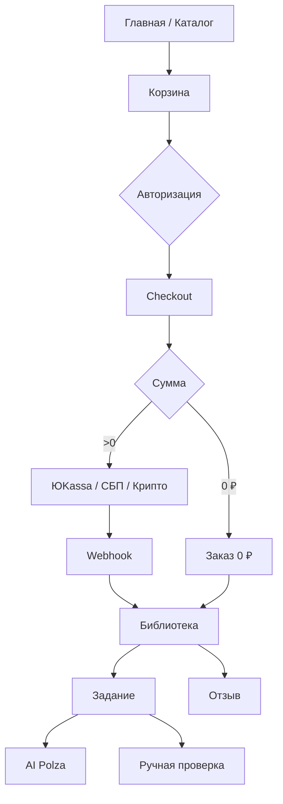

# User Flows

Пользовательские сценарии платформы «Дизайн Тусовка». Согласовано с `PRODUCT.md` и `BUSINESS_RULES.md`.

## UF-01 Регистрация, вход, профиль

1. Регистрация: email + пароль или Google OAuth.
2. Подтверждение email (письмо Supabase).
3. Вход; восстановление пароля.
4. Профиль: библиотека, заказы, задания, AI/ручные проверки, настройки, уведомления.
5. Настройки: имя, аватар, email, пароль, Telegram, уровень дизайнера.

**Блокировки:** без подтверждённого email — нельзя оплатить (AUTH-03) и отправить решение (AUTH-04).

**Удаление аккаунта:** запрос в поддержку → деактивация; заказы/оплаты/чеки сохраняются.

## UF-02 Каталог (главная)

1. Главная = каталог: карточки материалов, заданий, разделов.
2. Поиск по материалам, заданиям, разделам (главы не индексируются).
3. Фильтры: тип, уровень, раздел, цена, бесплатный/платный, наличие проверки.
4. Сортировка: новые, популярные, дешёвые, дорогие.
5. Карточка материала: обложка, тип, название, описание, уровень, теги, цена, раздел, статус доступа, средняя оценка, кол-во отзывов.
6. Карточка задания: + «AI бесплатно», «Эксперт платно».
7. Переход на страницу товара.

## UF-03 Корзина и checkout (платный)

1. Гость добавляет в локальную корзину; после входа — merge, дедупликация.
2. Проверки: не куплено; материал не в купленном разделе; конфликт раздел/материал (CART-06).
3. Снятые с продажи — удаление с уведомлением.
4. Checkout: авторизация + email confirmed; пересчёт суммы на сервере.
5. При изменении цены — актуальная цена + уведомление.
6. Выбор оплаты: ЮKassa / СБП QR / крипто (USDT по курсу на срок счёта).
7. Оплата целого заказа целиком.
8. Webhook → выдача доступа; UI «Платёж подтверждается» при задержке.
9. Товары в библиотеке (бессрочно).

**При ошибке/отмене:** корзина сохраняется; новый заказ при повторе.

## UF-04 Бесплатный заказ (0 ₽)

1. Бесплатный материал/задание в корзине.
2. CTA: **«Получить бесплатно»**.
3. Заказ на 0 ₽ → материал в библиотеке.
4. Бесплатное **задание** в библиотеке — только после первой отправки решения.

## UF-05 Просмотр материала

1. До покупки (платный): описание, содержание (оглавление глав), не текст глав.
2. После покупки / бесплатный: полный контент, вложения, похожие материалы.
3. Обновления купленного материала — бесплатно, автоматически.

## UF-06 Покупка раздела

1. Добавление раздела в корзину.
2. Сервер: цена минус фактически оплаченные материалы из раздела.
3. Если все материалы уже куплены — раздел считается купленным.
4. Оплата → доступ к материалам раздела на момент покупки.
5. Новые материалы → UF-07 (обновление раздела).

## UF-07 Обновление раздела

1. Админ публикует обновление с ценой.
2. Метка на карточке раздела + баннер в библиотеке.
3. Покупка обновления → все пропущенные новые материалы.

## UF-08 Библиотека

1. Единый список: материалы, задания, разделы.
2. Фильтр по типу и тегам.
3. Бесплатные и платные вместе (статусы, теги).
4. История заказов в профиле.
5. Прогресс **не** отслеживается.

## UF-09 Отправка задания

1. Авторизация + email confirmed.
2. Ввод: ссылка Figma/FigJam, файлы, комментарий (без сохранения черновика).
3. Опционально: AI-проверка (бесплатно, 1 раз) или ручная (платно на этом шаге).

## UF-10 AI-проверка

1. Выбор файлов: PDF ≤20 МБ или до 10 PNG/JPG ≤10 МБ.
2. Валидация на сервере; нечитаемые не уходят в AI.
3. Polza AI с критериями задания (без весов).
4. Результат: разбор, итог, рекомендации (без баллов) → профиль бессрочно.
5. Техошибка — попытка не списывается.

## UF-11 Ручная проверка

1. На финальном шаге отправки: оплата (не корзина) → автоотправка после webhook.
2. До 5 файлов × 50 МБ, 1 ссылка, комментарий.
3. Очередь; владелец проверяет в админке.
4. Результат с версиями; возможна доработка (1 повторная отправка).
5. Уведомления: готова проверка / требуется доработка.

## UF-12 Отзыв

1. Условие: получил/купил товар; раздел — только целый раздел.
2. Оценка 1–5 + текст; сразу публикуется.
3. Редактирование и удаление пользователем.

## UF-13 Возврат

1. Письмо на email поддержки (причина, доказательства).
2. Админ решает вручную.
3. Доступ отзывается; раздел — только целиком.

## UF-14 Поддержка и юридическое

1. Страница поддержки: email, FAQ, возвраты, проблемы с оплатой.
2. Cookie-баннер → согласие → Яндекс Метрика + Вебвизор.
3. Оферта, политика конфиденциальности, согласие на ПДн (**тексты TBD**).

## UF-15 Администрирование

См. `ADMIN_REQUIREMENTS.md`.

## Диаграмма

